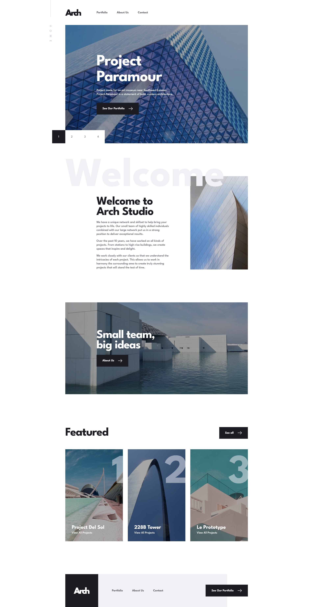

# Frontend Mentor - Arch Studio multi-page website solution

This is a solution to the [Arch Studio multi-page website challenge on Frontend Mentor](https://www.frontendmentor.io/challenges/arch-studio-multipage-website-wNIbOFYR6). Frontend Mentor challenges help you improve your coding skills by building realistic projects.

## Links

- Solution URL: [Frontend Mentor Solution Page](https://your-solution-url.com)
- Live Site URL: [GitHub Pages Site](https://your-live-site-url.com)

## Built with

- Semantic HTML5 markup
- CSS custom properties
- Flexbox
- CSS Grid
- Mobile-first workflow
- TypeScript
- [Vite](https://vitejs.dev/)

## Useful resources

- [Leaflet JS](https://leafletjs.com/)

## Author

- Frontend Mentor - [@karolbanat](https://www.frontendmentor.io/profile/karolbanat)

## Screenshots

